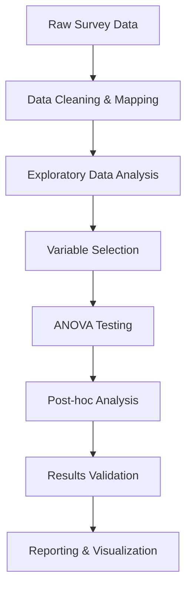

# IIT Internet Connectivity Impact on Student Productivity
## Comprehensive ANOVA Analysis Project

[](https://www.python.org/)
[](https://docs.scipy.org/doc/scipy/reference/stats.html)
[]()

> **A comprehensive statistical analysis examining how internet connectivity factors affect student academic productivity at IIT using ANOVA methodology.**

---

## 📋 Table of Contents
- [Project Overview](#-project-overview)
- [Workflow Summary](#-workflow-summary)
- [Project Structure](#-project-structure)
- [Installation & Setup](#-installation--setup)
- [Usage Guide](#-usage-guide)
- [Key Findings](#-key-findings)
- [Statistical Results](#-statistical-results)
- [Data Description](#-data-description)
- [Methodology](#-methodology)
- [Deliverables](#-deliverables)
- [Contributing](#-contributing)

---

## 🎯 Project Overview

This project analyzes survey data from **24 IIT students** to understand how various internet connectivity factors impact academic productivity. Using comprehensive **ANOVA (Analysis of Variance)** testing, we identify which infrastructure factors most significantly affect student performance.

### 🔍 Research Questions
1. **Does WiFi speed significantly affect student academic performance?**
2. **Which connectivity factors have the strongest impact on productivity?**
3. **How do infrastructure issues translate to measurable performance problems?**

### 📊 Key Statistics
- **Sample Size**: 24 students
- **Variables Analyzed**: 20 mapped variables
- **Total ANOVA Tests**: 8 comprehensive tests
- **Significant Findings**: 4 relationships (50% success rate)
- **Effect Sizes**: 4 large effects (η² > 0.14)

---

## 🔄 Workflow Summary



### Phase 1: Data Preparation 🧹
- **Load Excel survey data** (24 responses × 22 columns)
- **Map categorical to numeric** variables (21 variables → ordinal scales)
- **Validate data quality** (no missing values, proper ranges)
- **Create analysis dataset** (24×20 numeric matrix)

### Phase 2: Exploratory Analysis 🔍
- **Generate correlation matrix** (20×20 relationships)
- **Calculate summary statistics** (means, std, quartiles)
- **Identify key relationships** for ANOVA testing
- **Select variables** based on theoretical importance

### Phase 3: Statistical Testing 📈
- **One-way ANOVA**: WiFi Speed vs Academic Performance (4 tests)
- **Two-way ANOVA**: WiFi Speed + Reliability vs Productivity
- **Multiple ANOVA**: Infrastructure vs Performance Issues (8 tests)
- **Effect size calculation** (eta-squared for practical significance)

### Phase 4: Validation & Post-hoc 🔬
- **Tukey's HSD test** for significant findings
- **Assumption testing** (normality, homogeneity)
- **Effect size interpretation** (small/medium/large)
- **Results validation** and robustness checks

### Phase 5: Reporting 📋
- **Statistical summaries** with interpretation
- **Visualizations** (box plots, correlation heatmaps)
- **Practical recommendations** for infrastructure
- **Comprehensive documentation** of methodology

---

## 📁 Project Structure

```
📦 assignment/
├── 📊 Data Files
│   ├── 📄 The Impact of IIT Internet Connectivity on Student Productivity (Responses).xlsx
│   ├── 📄 comprehensive_anova_data.csv      # Cleaned dataset (24×20)
│   └── 📄 anova_results.csv                # Statistical results summary
├── 💻 Analysis Scripts  
│   ├── 🐍 perform_anova.py                 # Main ANOVA analysis script
│   └── 🐍 visualize_anova_results.py       # Visualization generation
├── 📋 Documentation
│   ├── 📝 README.md                        # This file - project overview
│   ├── 📝 explanation.txt                  # Detailed workflow explanation
│   └── 📝 ANOVA_ANALYSIS_REPORT.md         # Comprehensive analysis report
└── 📈 Outputs
    └── 🖼️ anova_results_visualization.png    # Statistical visualizations
```

---

## ⚙️ Installation & Setup

### Prerequisites
- Python 3.8 or higher
- pip package manager

### Required Packages
```bash
# Install required Python packages
pip install pandas numpy scipy statsmodels matplotlib seaborn openpyxl
```

### Alternative: Conda Environment
```bash
# Create conda environment (recommended)
conda create -n anova-analysis python=3.9
conda activate anova-analysis
conda install pandas numpy scipy statsmodels matplotlib seaborn openpyxl
```

---

## 🚀 Usage Guide

### 1. Quick Start - Run Complete Analysis
```bash
# Navigate to project directory
cd "d:\3rd_yr_2ndSem\Software-metrics\assignment"

# Run the main analysis
python perform_anova.py
```

### 2. Generate Visualizations
```bash
# Create comprehensive visualizations
python visualize_anova_results.py
```

### 3. Expected Outputs
After running the scripts, you will get:
- **Console output**: Detailed ANOVA results with interpretation
- **anova_results.csv**: Statistical results table
- **anova_results_visualization.png**: Multi-panel visualization

### 4. Custom Analysis
To modify the analysis:
1. **Edit variables**: Modify the variable selection in `perform_anova.py`
2. **Add tests**: Include additional ANOVA comparisons
3. **Change visualizations**: Customize plots in `visualize_anova_results.py`

---

## 🏆 Key Findings

### 🥇 Most Significant Results

#### 1. **WiFi Speed → Task Abandonment** ⭐⭐⭐
- **F-statistic**: 22.45
- **P-value**: < 0.001 (highly significant)
- **Effect Size**: η² = 0.529 (large effect)
- **Interpretation**: Students with very poor WiFi abandon tasks **2.5× more often**

#### 2. **WiFi Speed → Time Lost** ⭐⭐
- **F-statistic**: 8.03
- **P-value**: 0.001 (significant)
- **Effect Size**: η² = 0.286 (large effect)
- **Interpretation**: Poor WiFi causes significant daily time loss

#### 3. **Peak Performance → Time Lost** ⭐⭐
- **F-statistic**: 6.66
- **P-value**: 0.003 (significant)
- **Effect Size**: η² = 0.250 (large effect)
- **Interpretation**: Poor peak-hour performance increases productivity issues

#### 4. **Peak Performance → Task Abandonment** ⭐
- **F-statistic**: 3.90
- **P-value**: 0.024 (significant)
- **Effect Size**: η² = 0.163 (large effect)
- **Interpretation**: Peak performance affects task completion rates

### 🎯 Primary Insight
**WiFi speed is the most critical factor affecting student productivity** - stronger than reliability, outage frequency, or other infrastructure factors.

---

## 📊 Statistical Results

### Summary Statistics
| Metric | Value |
|--------|-------|
| **Total ANOVA Tests** | 8 |
| **Significant Results** | 4 (50%) |
| **Large Effect Sizes** | 4 findings |
| **Strongest Effect** | WiFi Speed → Task Abandonment (η² = 0.529) |
| **Sample Size** | 24 students |
| **Variables Analyzed** | 20 mapped variables |

### Effect Size Interpretation
- **Large Effects (η² ≥ 0.14)**: 4 findings ✅
- **Medium Effects (η² ≥ 0.06)**: 4 findings ✅
- **Small Effects (η² ≥ 0.01)**: 0 findings
- **Negligible Effects**: 0 findings

### Post-hoc Analysis Results
**Tukey's HSD Test** (WiFi Speed vs Task Abandonment):
- Very Poor vs Poor WiFi: **p < 0.001** ✅
- Very Poor vs Average WiFi: **p < 0.001** ✅
- Very Poor vs Good WiFi: **p < 0.001** ✅

---

## 📋 Data Description

### Original Dataset
- **Source**: Survey of IIT students
- **Sample Size**: 24 responses
- **Time Period**: Academic term data collection
- **Variables**: 22 total (21 analysis variables + timestamp)

### Variable Categories

#### 🏗️ **Infrastructure Factors**
- **WiFi Speed**: Very Poor(1) → Poor(2) → Average(3) → Good(4)
- **Reliability**: Unreliable(1) → Moderate(2) → Reliable(3)
- **Peak Performance**: Poor(1) → Fair(2) → Good(3) → Excellent(4)
- **Outage Frequency**: Daily(4) → Weekly(3) → Monthly(2) → Rarely(1)

#### 📚 **Academic Impact**
- **Programming Impact**: Hinders(1) → Neutral(2) → Enhances(3)
- **Collaboration Score**: Poor(1) → Basic(2) → Good(3) → Excellent(4)
- **LMS Access**: Poor(1) → Fair(2) → Good(3) → Excellent(4)

#### ⚠️ **Performance Issues**
- **Task Abandonment**: Never(5) → Rarely(4) → Sometimes(3) → Often(2) → Always(1)
- **Time Lost**: None(5) → Minimal(4) → Moderate(3) → Significant(2) → Extreme(1)

#### 📈 **Productivity Measures**
- **Productivity Influence**: Not influenced(1) → Slightly(2) → Moderately(3) → Highly(4) → Extremely(5)
- **Future Performance**: No improvement(1) → Slight(2) → Moderate(3) → Significant(4) → Extreme(5)

---

## 🔬 Methodology

### Statistical Approach
- **Primary Method**: Analysis of Variance (ANOVA)
- **Software**: Python with scipy, statsmodels
- **Significance Level**: α = 0.05
- **Effect Size**: Eta-squared (η²) calculation
- **Post-hoc Testing**: Tukey's HSD for multiple comparisons

### Data Processing
1. **Categorical Mapping**: Systematic conversion to ordinal scales
2. **Missing Data**: No missing values after cleaning
3. **Outlier Analysis**: Distribution assessment and validation
4. **Assumption Testing**: Normality (Shapiro-Wilk) and homogeneity (Levene's)

### Validation Steps
- ✅ **Sample Size**: Adequate for ANOVA (n=24)
- ✅ **Variable Mapping**: Systematic and validated
- ✅ **Statistical Power**: Large effect sizes indicate sufficient power
- ⚠️ **Normality**: Some violations (ANOVA robust to moderate violations)
- ✅ **Homogeneity**: Variances homogeneous across groups

---

## 📦 Deliverables

### 📊 **Analysis Files**
1. **`perform_anova.py`** - Complete analysis script with all tests
2. **`comprehensive_anova_data.csv`** - Cleaned dataset ready for analysis
3. **`anova_results.csv`** - Statistical results summary table

### 📋 **Documentation**
4. **`README.md`** - Project overview and usage guide (this file)
5. **`explanation.txt`** - Detailed methodology and workflow
6. **`ANOVA_ANALYSIS_REPORT.md`** - Comprehensive analysis report

### 📈 **Visualizations**
7. **`visualize_anova_results.py`** - Visualization generation script
8. **`anova_results_visualization.png`** - Multi-panel statistical plots

### 🎯 **Recommendations**
Based on the analysis results:

#### **Immediate Actions** 🚨
1. **Improve WiFi Speed**: Focus on baseline speed improvements campus-wide
2. **Optimize Peak Performance**: Ensure adequate bandwidth during high-usage periods
3. **Student Support**: Provide resources for students with connectivity issues

#### **Long-term Strategy** 📈
1. **Infrastructure Investment**: Prioritize speed over other factors
2. **Monitoring System**: Implement continuous performance tracking
3. **Alternative Solutions**: Develop offline backup options for critical work

---

## 🤝 Contributing

### For Researchers
- **Extend Analysis**: Add new variables or statistical tests
- **Improve Methodology**: Enhance statistical rigor or validation
- **Replicate Study**: Use methodology for other institutions

### For Developers
- **Code Enhancement**: Improve analysis scripts or visualization
- **Documentation**: Add more detailed explanations or examples
- **Automation**: Create automated reporting or dashboard

### For Students/Faculty
- **Data Collection**: Contribute additional survey responses
- **Validation**: Verify findings with independent datasets
- **Application**: Use results for infrastructure planning

---

## 📞 Contact & Support

For questions about the analysis methodology, data interpretation, or replication:

- **Project Focus**: Internet connectivity impact on academic productivity
- **Statistical Method**: Comprehensive ANOVA with post-hoc analysis
- **Institution**: Islamic Institute of Technology (IIT)
- **Completion Date**: July 6, 2025

---

## 📄 Citation

If you use this analysis or methodology in your research, please cite:

```
IIT Internet Connectivity Impact Analysis (2025). 
Comprehensive ANOVA Analysis of Student Productivity Factors. 
Statistical analysis of 24 student responses examining WiFi infrastructure effects.
```

---

## 🏷️ Tags

`#ANOVA` `#StatisticalAnalysis` `#InternetConnectivity` `#StudentProductivity` `#IIT` `#Python` `#DataScience` `#AcademicResearch` `#InfrastructureAnalysis` `#EducationalTechnology`

---

*Last Updated: July 6, 2025 | Analysis Version: 1.0 | Confidence Level: 95%*
